  

### ~/about

i make discord bots, backend stuff and ai tools. building <!-- recent -->[tag-team](https://github.com/AeroUp/Tag-Team) + [relay](https://github.com/AeroUp/Relay)<!-- /recent --> rn.

discord: `@aerotechy.`

### ~/stack

### ~/projects

<table>
<tr>
<td width="50%" valign="top">

**[tag-team](https://github.com/AeroUp/Tag-Team)** 
claude, codex & antigravity working together. They ask each other, review each other's code, and make images.

</td>
<td width="50%" valign="top">

**[relay](https://github.com/AeroUp/Relay)** 
your ai hits its usage limit, another one takes the baton, and the first wakes back up to finish.

</td>
</tr>
<tr>
<td width="50%" valign="top">

**[visor](https://github.com/AeroUp/Visor)** 
in-game overlay for roblox: server browser, server hop, badges and multi-account, one hotkey away.

</td>
<td width="50%" valign="top">

**[rdpcontrol](https://github.com/AeroUp/RdpControl)** 
check on your game macro from discord: screenshots, crash and frozen-screen alerts, remote keys.

</td>
</tr>
</table>

### ~/activity

  

more stats

